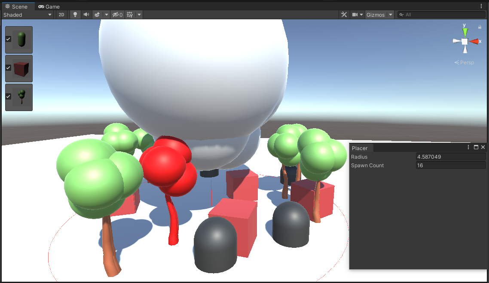
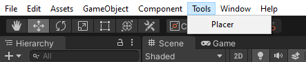

# Unity Placer



## Description 📝

This repository contains a script that allows the user to instantiate prefabs from the "Assets/Prefabs" folder. The main functionality of this script is the Placer tool, which can be accessed through a new tab called "Tools" located in the upper corner of the Unity interface.

This tool is based on an assignment from the course "Intro to Tool Dev in Unity," which is part of the following playlist: [Intro to Tool Dev in Unity](https://www.youtube.com/playlist?list=PLImQaTpSAdsBKEkUvKxw6p0tpwl7ylw0d).

## Functionality 🛠️

The "Placer" tool allows the user to select the quantity of assets to be instantiated and define an area using a radius where these assets will be placed in the environment. The radius determines the size of the circular area where the objects will be distributed.

## Collision Detection 🚫

If an object's height causes it to collide with any object above it, the object turns red and is not instantiated to avoid overlapping or clipping issues.

## Instantiation ⚡️

To instantiate the selected objects in the scene camera, simply toggle the desired objects and press the `spacebar`. This will create the objects within the defined area determined by the radius, taking into account collision detection.

## Usage 🔧

1. Clone the Unity Placer repository to your preferred location:

   ```
   git clone https://github.com/murilo-oak/Unity-Placer.git
   ```

2. Open the Unity Hub and add the "unity-placer" project by clicking the `Add` icon and selecting the cloned folder.

3. Select the "unity-placer" project in the Unity Hub and wait for Unity to load the project.

4. Now you can access the `Tools` tab in the upper corner of the Unity interface to use the "Placer" tool.
  
   

7. Select the "Placer" tool in the `Tools` tab.

8. Set the quantity of assets to be instantiated and adjust the radius using the mouse scroll to increase or decrease the value.

9. If you want to use the mouse scroll to zoom in the scene, press the `Alt` key.

10. Toggle the desired objects using the toggle feature.

11. Press the `spacebar` to instantiate the selected objects within the defined area determined by the radius. Make sure you have the Scene View selected.

12. To undo the instantiation action, press the `Ctrl + Z` keys.

## License 📄

This project is licensed under the [MIT License](LICENSE).